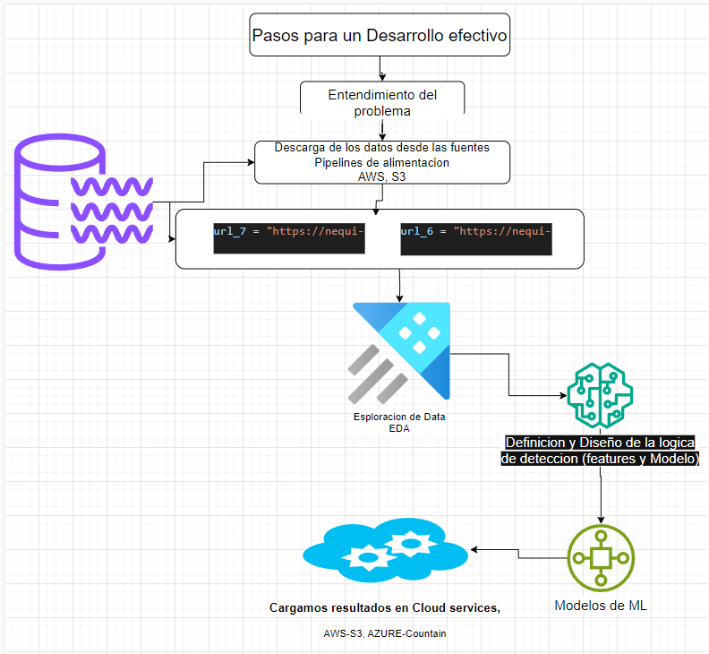
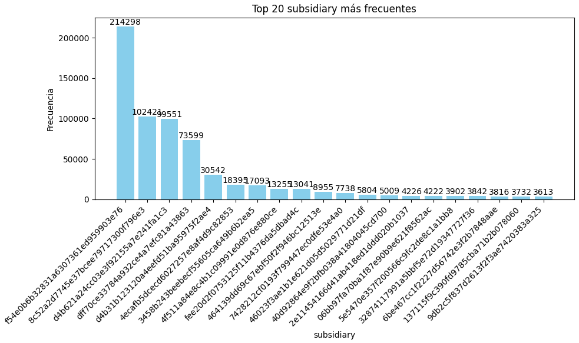

# Detección de Fraccionamiento Transaccional

Este documento describe el proceso seguido para **explorar** los datos, **identificar** variables relevantes y **definir** un modelo heurístico para detectar la práctica del **Fraccionamiento Transaccional**, entendida como la división de una transacción grande en varias más pequeñas dentro de una misma ventana de 24 horas.

---

## Tabla de Contenido
1. [Introducción](#introducción)  
2. [Objetivo](#objetivo)  
3. [Metodo](#Metodo) 
4. [Diccionario de Variables](#Diccionario-de-Variables)
5. [EDA](#EDA)  
   - [Data Quality](#Data-Quality)  
   - [Estadisticas](#Estadisticas)  
   - [Hipótesis preliminares](#hipótesis-preliminares)
6. [Flujo Modelo Analítico](#Flujo-Modelo-Analítico)  
   - [Data flow](#Data-flow)
7. [Seleccion modelo](#Seleccion-modelo)
   - [Frecuencia de actualizacion](#Frecuencia-de-actualizacion)
8. [Graficas](#Graficas)
9. [Conclusiones](#conclusiones)
   - [Implementación](#1-implementación)
   - [Trazabilidad](#2-trazabilidad)
   - [Monitoreo](#3-monitoreo)
   - [Próximos pasos](#4-próximos-pasos)

---

## Introducción
Se desea dar solucion a la prueba tecnica, y para ello se genera un enlace de donde se encuentran los datos, que contienen informacion de las transaciones, donde la pruba consiste en **Encontrar y detectar patrones** de mala practica transacional en este caso **Fracionamiento transaccional**  donde se entiende en este caso que es una practica que consiste en fraccional o dividir  una transaccion grande en multiples pequeñas, estas se caracterizan por estar en una ventana que suele ser de 24 horas y que tienen como origen o destino la misma cuenta.

---

## Objetivo
El objetivo de la prueba es idear una solución para identificar transacciones que evidencian un 
comportamiento de Mala Práctica Transaccional, empleando un producto de datos. Adicional, 
describir la solución y detallar cómo incorporar el producto de datos en un marco operativo.

## Metodo
Mediante el EDA que es la exploracion de los datos y analisis. se espera que se saque la propuesta para el modelo y sus reglas, ademas de que se diseñe la arquitectura para despegar la solucion.

---

### Diccionario de Variables

- **`_id`**: Identificador único del registro.
- **`merchant_id`**: Código único del comercio o aliado.
- **`subsidiary`**: Código único de la sede o sucursal.
- **`transaction_date`**: Fecha de transacción en el core financiero.
- **`account_number`**: Número único de cuenta.  
- **`user_id`**: Código único del usuario dueño de la cuenta desde donde se registran las transacciones.
- **`transaction_amount`**: Monto de la transacción (en moneda ficticia).
- **`transaction_type`**: Naturaleza de la transacción (crédito o débito).

---

## EDA
En esta parte se trabajo con el 60% de una de las bases, que reprecentan un **6.456.562 de filas**  y  **1.570.006 de clientes unicos** por capacidad de procesamieto, no se decidio unir los dos datasets.

### Data Quality
1. No se identificaron nombres de columnas en mal estado pero mas sin embargo por si en proximas oportunidades viene con caracteres especiales o cosas asi se creo codigo que las mejore.
2. No se encontraron valores nulos.
3. se observa en algunos casos que algunos usuarios tiene el mismo numero de cuenta.
4. No se observa duplicidad en el _id que debe ser unico.
5. Se observa duplicidad entre el numero de usuario user_id, y la misma fecha hora de transaccion transaction_date, los cuales fueron eliminados


### Estadisticas
- **Montos (`transaction_amount`)**  
  - Máximo: 3210.00
  - Mínimo: 5.94
  - Promedio:  178.46 
  - Desviación Estándar: ~263.35

- **Distribución por tipo (`transaction_type`)**  
  - Débito  x= 1301261, representa el 0.79 del total de la data
  - Crédito x= 5155223, representa el 0.21 del total de la data

- **Diferencia proedio en horas por transaccion (`avg_diff_hours`)**
  - Máximo: 23.98
  - Mínimo: 0.0002
  - Promedio:  1.41 
- **Diferencia promedio en minutos por transaccion (`avg_diff_minutes`)**
  - Máximo:   1438.75
  - Mínimo:   0.02
  - Promedio: 85.086
- **Usuarios con mas de 3 transaciones en un dia o ventada de 24 horas**
   -  se encuentran `43.571` usuarios unicos que posiblemente estan realizando Fracionamiento transaccional
      estos se pueden separar en dos grupos los que acumulan un monto total menor de 3000 dolares o mayor e igual a 3000 dolares en sus transaciones
   - De los datos podemos ver que para las transacciones totales menores a 3000 dólares, el tiempo promedio entre transacciones es de 44.32 minutos. y que el 50% de estas transacciones se realizaron con una diferencia de tiempo entre ellas menor a 5.79 minutos.
   - De los datos podemos ver que para las transacciones totales mayores e iguales a 3000 dólares, el tiempo promedio entre transacciones es de 13.67 minutos. y que el 50% de estas transacciones se realizaron con una diferencia de tiempo entre ellas menor a 1.47 minutos

### Hipótesis preliminares
1. **Fraccionamiento por conteo**: Si un usuario hace más de 2 transacciones en 24h, podría ser considerado como  que esta realizando fraccionamiento transaccional, se toma mas de 2 porque la segunda pudo haber sido un error en el pago o le falto pagar la diferencia o n casos asi.
---

## Flujo Modelo Analítico

### Data flow
```plaintext
┌─────────────────────────────────────┐
│  Pasos para un desarrollo efectivo  │    
└─────────────────────────────────────┘
          │
          ▼
┌──────────────────────┐
│  Entendimiento       │ 
│   del problema       │
└──────────────────────┘
          │
          ▼
┌──────────────────────┐
│  DESCARGA DE DATOS   │ 
│  (Ingesta de Datos)  │
└──────────────────────┘
          │
          ▼
┌────────────────────────────────────────────────────┐
│1. RECEPCIÓN DE DATOS (ARCHIVOS CSV, PARQUET, ETC.) │
│   - Lectura de los ficheros                        │
│   - Otras fuentes de datos                         │
└────────────────────────────────────────────────────┘
          │
          ▼
┌───────────────────────────────────────────────────────┐
│2. PREPROCESAMIENTO Y VALIDACIÓN                       │
│   - Limpieza de registros (valores nulos, duplicados) │
│   - Formateo de fechas (datetime)                     │
│   - Conversión de tipos                               │
│   - Garantizar la integridad de los datos             │
└───────────────────────────────────────────────────────┘
          │
          ▼
┌──────────────────────────────────────────────────┐
│3. APLICACIÓN DE LA LÓGICA (REGLA DE NEGOCIOS)    │
│   - Para cada transacción, verificar si cumple   │ 
│     el criterio de fraccionamiento en 24h        │
│   - Crear la columna “windows_time”  donde si    |
|     aparece almenos dos veces el mismo inicados  |
|     es que fue fracionada, osea si el indicados  |
|    1 aparece tres veces quiere decir que esa     |
|     cuenta fue fracionada 3 veces en mesnoo      |
|     de 24 horas                                  │
└──────────────────────────────────────────────────┘
          │
          ▼
┌────────────────────────────────────────────────────────────────┐
│4. GENERACIÓN DE ATRIBUTOS (FEATURES)                           │
│   - Calculo de diferencia en horas y minutos por transaccion   │
│   - Cálculo de montos promedios                                │
│   - identificacion de usuarios con mas de 2 transacciones      |
|                     en menos de 24 horas                       |
|   - Comportamiento de variables para esos clientes              │
└────────────────────────────────────────────────────────────────┘
          │
          ▼
┌─────────────────────────────────────────────────────────────┐
│5. SALIDA                                                    │
│   - Almacenamiento de resultados (CSV, Base de datos, etc.) │
│                                                             │
└─────────────────────────────────────────────────────────────┘
          │
          ▼
┌───────────────────┐
│  FIN DEL PROCESO  │
└───────────────────┘
```
### Flujo Modelo Analitico


---
---
## Seleccion modelo
 El modelo analitico me tiene que identificar si hay n transacciones en el dia en una ventana de tiempo de 24 horas,
 para que los encargados del tratamiento de estos casos se puedan hacer cargo de ello.

```python
# Asegúrate de que la columna transaction_date esté en formato timestamp
dfu = dfu.withColumn("transaction_time", to_timestamp(col("transaction_date"), "yyyy-MM-dd HH:mm:ss"))
dfu = dfu.orderBy("user_id", "transaction_time")
```
#### Calculo de las ventanas de tiempo y diferencia en horas y minutos entre transacciones
```python
# === 1) Definir la columna 'day' ===
dfu = dfu.withColumn("day", to_date(col("transaction_time")))

# === 2) Detectar cambio de día con lag(day) ===
# Ventana principal: particionamos por user_id y ordenamos por transaction_time
w_user_order = Window.partitionBy("user_id").orderBy("transaction_time")

dfu = dfu.withColumn(
    "prev_day",
    lag("day").over(w_user_order)
)

# Creamos una bandera day_change que es 1 cuando cambia el día, 0 si es el mismo día
dfu = dfu.withColumn(
    "day_change_flag",
    when(col("prev_day").isNull(), 0)  # primera transacción => no cambia día
    .when(col("day") != col("prev_day"), 1)
    .otherwise(0)
)

# === 3) day_group: identificador acumulado de cada día, por usuario ===
# Sumar en forma acumulada la bandera day_change_flag
dfu = dfu.withColumn(
    "day_group",
    _sum("day_change_flag").over(w_user_order)
)
# Así, cada vez que day_change_flag = 1, se incrementa day_group en 1

# --- Limpieza opcional ---
dfu = dfu.drop("prev_day", "day_change_flag")

# === 4) Calcular diff_hours dentro de cada día_group ===
#  (1) Definir ventana que particiona por user_id y day_group, ordena por fecha/hora
w_user_day = Window.partitionBy("user_id", "day_group").orderBy("transaction_time")

# (2) Calcular la transacción anterior dentro del mismo day_group
dfu = dfu.withColumn(
    "prev_tr_time_tmp",
    lag("transaction_time").over(w_user_day)
)

# (3) Si es la primera transacción del day_group, prev_tr_time_tmp estará en null
#     Asignamos la transaction_time actual para que diff_hours = 0 en esa fila
dfu = dfu.withColumn(
    "prev_tr_time",
    when(col("prev_tr_time_tmp").isNull(), col("transaction_time"))
    .otherwise(col("prev_tr_time_tmp"))
)
dfu = dfu.drop("prev_tr_time_tmp")

# (4) Calcular diff_hours
dfu = dfu.withColumn(
    "diff_hours",
    (unix_timestamp("transaction_time") - unix_timestamp("prev_tr_time")) / 3600
)

dfu = dfu.withColumn(
    "diff_minutes",
    (unix_timestamp("transaction_time") - unix_timestamp("prev_tr_time")) / 60
)

# === 5) new_window_flag: si diff_hours > 24, se abre una nueva ventana ===
dfu = dfu.withColumn(
    "new_window_flag",
    when(col("diff_hours") > 24, 1).otherwise(0)
)

# === 6) Calcular windows_time dentro de cada day_group ===
#     - sumamos en forma acumulada new_window_flag y le sumamos 1 para iniciar en 1
dfu = dfu.withColumn(
    "windows_time",
    _sum("new_window_flag").over(w_user_day) + 1
)

# (Opcional) limpiar columnas
dfu = dfu.drop("new_window_flag","windows_time")
dfu = dfu.withColumnRenamed("day_group", "windows_time")
# Ajustar la columna "day_group" para que inicie en 1
dfu = dfu.withColumn("windows_time", col("windows_time") + 1)
# dfu.show(truncate=False)
dfu = dfu.withColumn("diff_hours", round(col("diff_hours"), 2))
dfu = dfu.withColumn("diff_minutes", round(col("diff_minutes"), 2))
```
#### Identificacion de usuarios que tienen  mas de dos transaciones en un solo dia
```python
# Agrupar por 'user_id' y 'windows_time', contar los 'windows_time' y sumar 'transaction_amount'
df_count = dfu.groupBy("user_id", "windows_time") \
    .agg(
        F.count("windows_time").alias("windows_time_count"),
        F.sum("transaction_amount").alias("total_transaction_amount"),
        F.avg("diff_hours").alias("avg_diff_hours")  # Promedio de diff_hours
    )
# Filtrar aquellos 'user_id' donde el conteo de 'windows_time' sea mayor a 2
df_filtered = df_count.filter(F.col("windows_time_count") > 2)
# Ordenar por total_transaction_amount de mayor a menor
df_filtered = df_filtered.orderBy(F.col("total_transaction_amount").desc())
# Mostrar el resultado
print('# Usuarios unicos que estan haciendo Fraccionamiento transaccional',df_filtered.select("user_id").distinct().count())
df_filtered.show(truncate=False)
```
#### Esta parte hasta aqui me genera los clientes que tienen mas de 2 transaciones en un corte de 24 horas desde que realizo la primera transaccion en ese dia

### Frecuencia de actualizacion
Dado los hallazgos la frecuencia de actualizacion que se propone debe ser diariamente y hora a hora, esto para poder determinar rapidamente quien esta iniciando a realizar fraccionamiento transaccional.  Como alternativa  de arquitectura se sugiere trabajar con Azure Synapses dado que este es un servicio de analisis empresarial que acelera el tiempo para la optencion de informacion en tiempo real a demas de que  reune lo mejor de las tecnologias de SQL y de Spark. este servicio es perfecto para casos de Streaming donde se debe manejar data en tiempo real. y en el se pueden generar alertas de acuerdo a los criterios que dispongamos, porjemplo mande una alerta cuando un cliente en menos de dos horas ya halla generdo mas de 5 transacciones. en azure synapse se puede selecionar elcluster con el que se va a trabajar y cuadrar para que tenga el menor consumo de acuerdo a la cantidad de datos que se vana a manejar.  

---

## Graficas
### Grafica top Subsidiary 
#### Esta Grafica nos muestra el top 20 de las Subsidiary mas frecuentes donde observamos que la subsidiary 'f54e0b6b32831a6307361ed959903e76' tiene más de 214298 transacciones siendo la principal subsidiary


